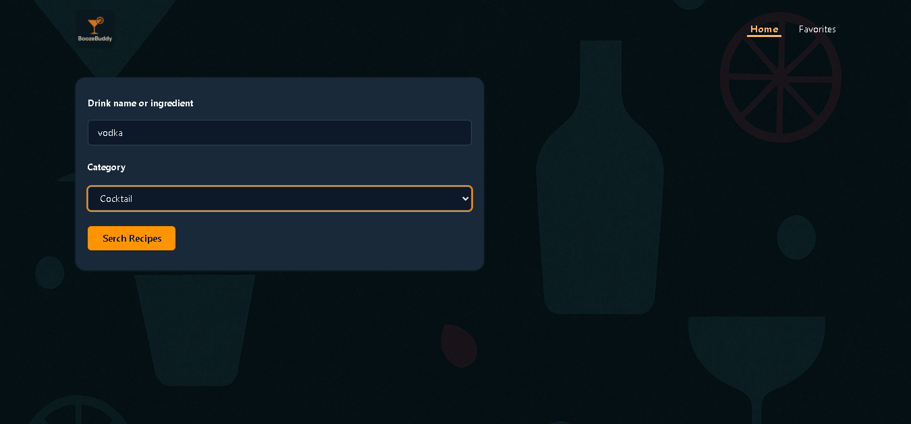
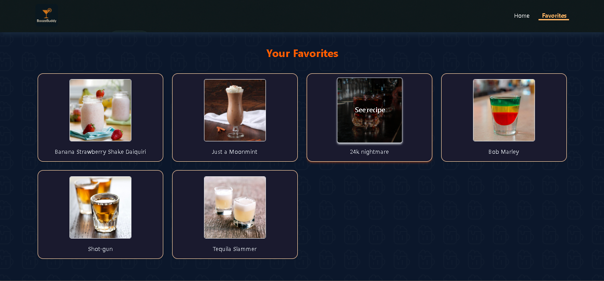

# 🍸 BoozeBuddy

**BoozeBuddy** is your go-to app to explore and discover delicious drink recipes based on your favorite ingredients or categories. It features a clean UI, smooth user experience, and allows users to save their favorite drinks for quick access — all in a fully responsive design.


## 🌐 Live Demo

👉 [Try BoozeBuddy Now](https://boozebuddy-drinks.netlify.app/)

---

## 🔍 Features

* 🔎 Search drinks by **ingredient** or **category**
* 🧪 API response validation using **Zod**
* 🧠 State management using **Zustand (slice pattern)**
* 📀 Persist favorite drinks to localStorage
* 💡 Clean and intuitive UI using **Tailwind CSS** and **Headless UI**
* 🛑 Page routing via **React Router DOM**

---

## 🛠️ Tech Stack

* **React**
* **Vite**
* **TypeScript**
* **Tailwind CSS**
* **Zustand**
* **Headless UI**
* **React Router DOM**
* **Axios**
* **Zod**

---

## 📂 Project Structure

```
src/
├── components/      # Reusable UI components
├── layouts/         # Shared layouts
├── schemas/         # Zod schemas for validation
├── services/        # API logic and helper functions
├── stores/          # Zustand state management (slice pattern)
├── types/           # Reusable TypeScript types
├── views/           # Main page views
├── Router.tsx       # React Router config
└── main.tsx         # App entry point
```

---

## 📸 Screenshots

### 🔍 Search Interface

 

### ❤️ Favorite Drinks



---

## 📡 API

This app uses [TheCocktailDB API](https://www.thecocktaildb.com/api.php) to fetch drinks data.

---

## 📦 Installation

1. Clone the repository:
   ```bash
   git clone https://github.com/Diego3128/BoozeBuddy.git
   cd breeze
   ```
2. Install dependencies:
   ```bash
   npm install
   ```
3. Start the development server:
   ```bash
   npm run dev-host
   ```

---

## 🤝 Contributing

Feel free to fork this repo, create a branch, and submit a pull request. Contributions are always welcome!

---

## 📝 License

This project is licensed under the MIT License.
